# 🏞 프로젝트 소개

- **🖥PJT명**: **Enjoy Trip Project**
- **🚶‍♂️단계**: **Algorithm PJT**
- **📅진행일자**: **2024.04.05**
- **👩‍💻팀원:** **이지표, 이학현**

- ## 프로젝트 설명
  - Web MVC Architecture를 이해하고 활용할 수 있다.
  - Web Back-End 기술인 Servlet / JSP(Java Server Page)를 이해하고 활용하여 웹 서버를 구축할 수 있다.
  - MVC 아키텍처를 활용하여 확장성과 편리한 유지보수 등 장점을 살려 좋은 웹 서버를 구축할 수 있다.

# 📦클래스 다이어 그램

# ⚙기본 기능

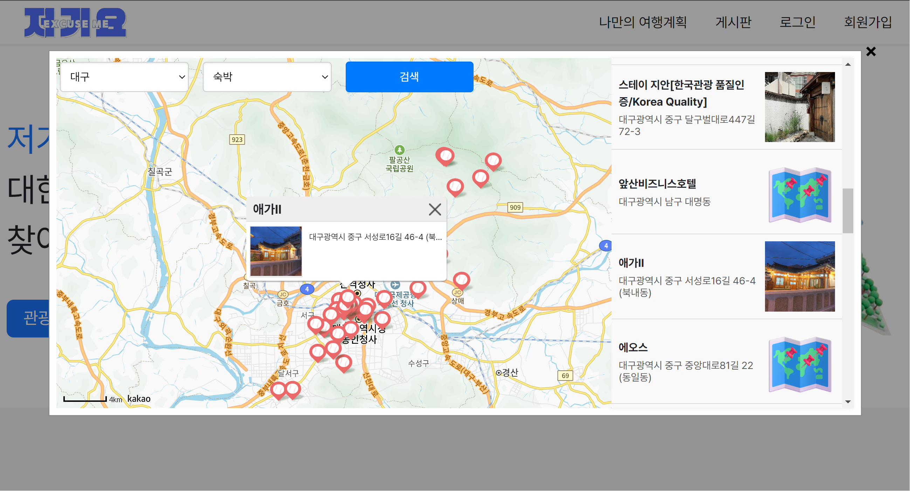
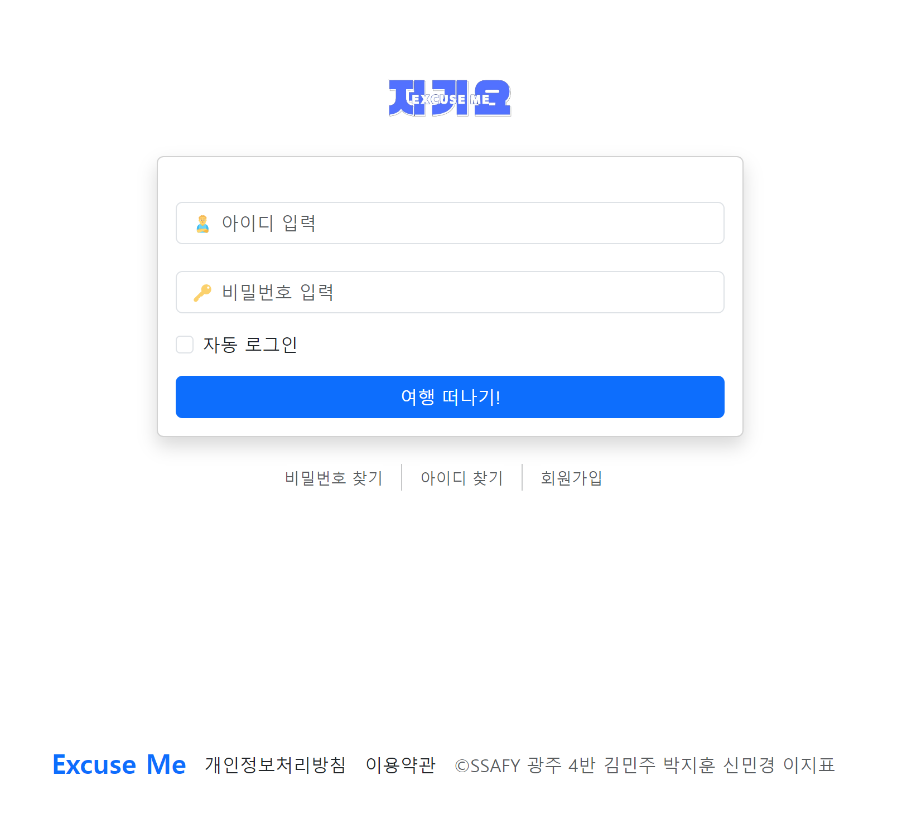
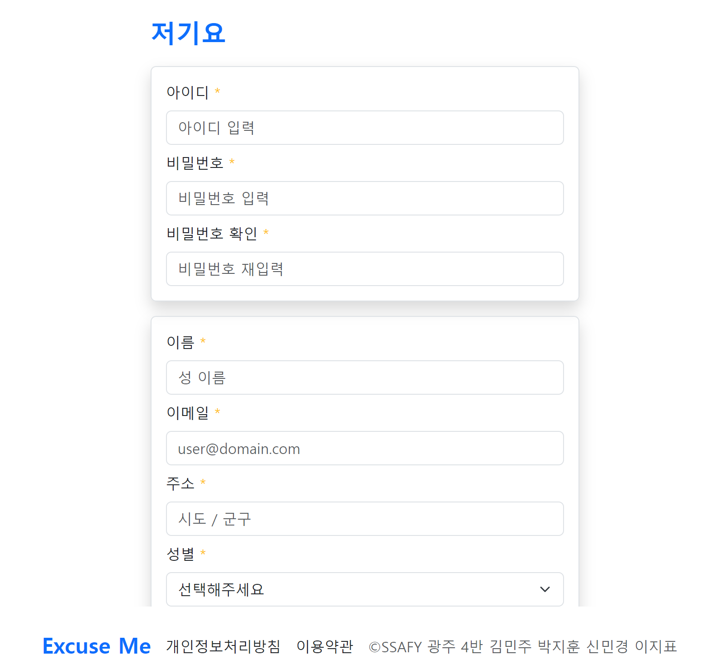
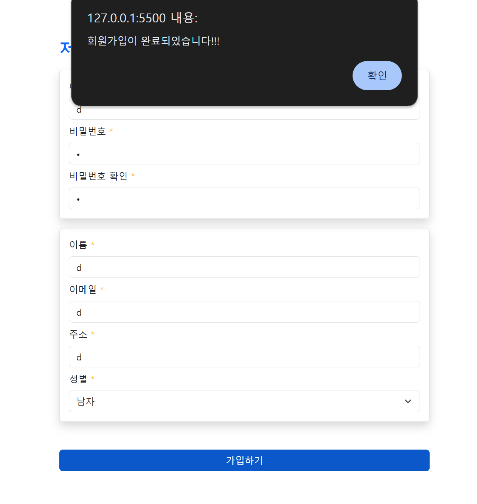
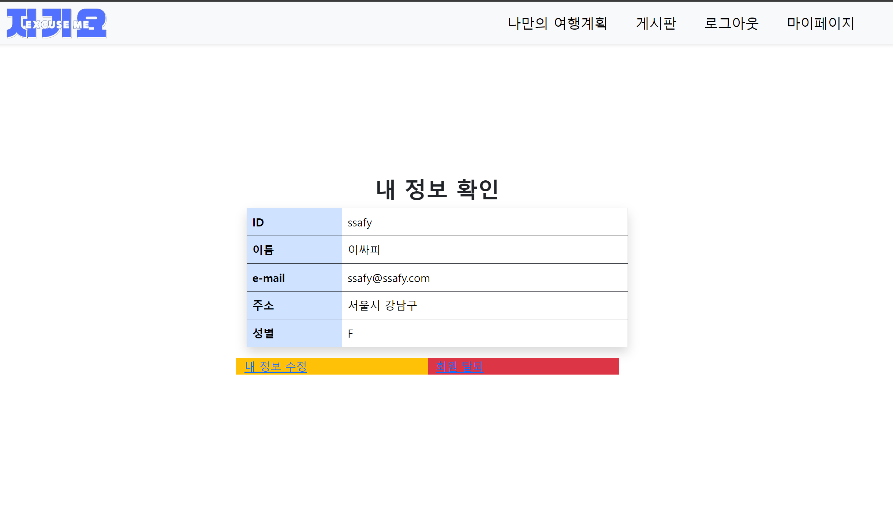
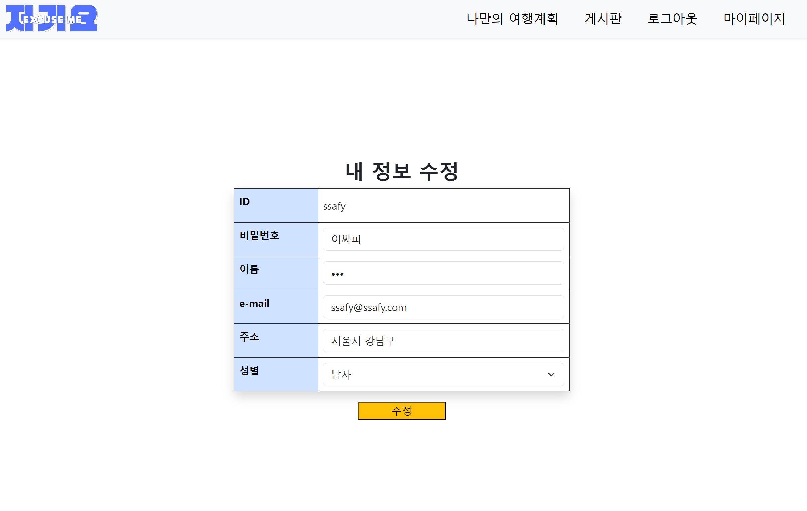
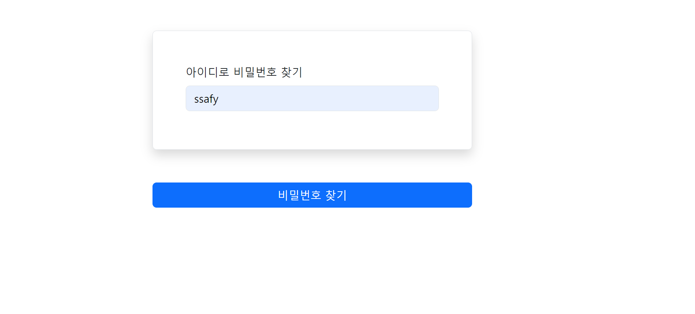
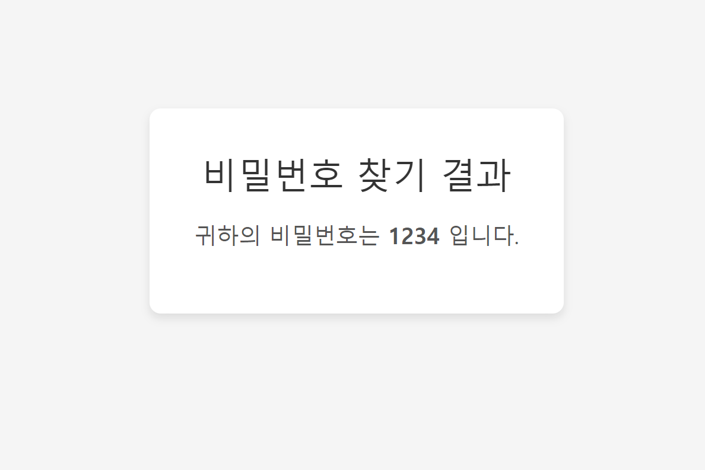

- ## ✔ 기본 기능
  - 메인 페이지 및 메뉴 구성
  - 관광지 정보 조회
  - 회원정보 등록, 수정, 삭제, 조회 화면
  - 회원관리 페이지
  - 로그인 / 로그아웃페이지

# 🧱추가 기능

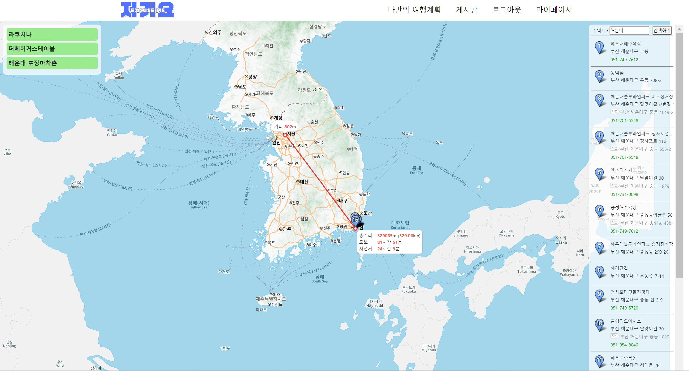

- ## ✔ 추가 기능
  - 사이트맵 / 전체적인 메뉴 구성 화면
  - 나만의 여행계획 페이지(팀별 아이디어)

# 💪심화 기능

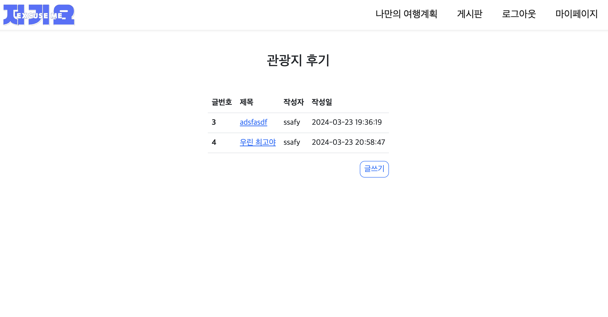
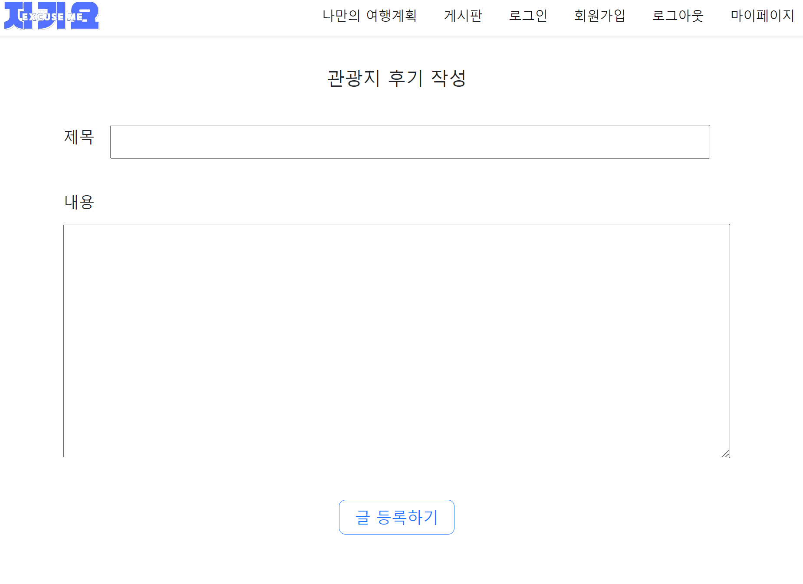
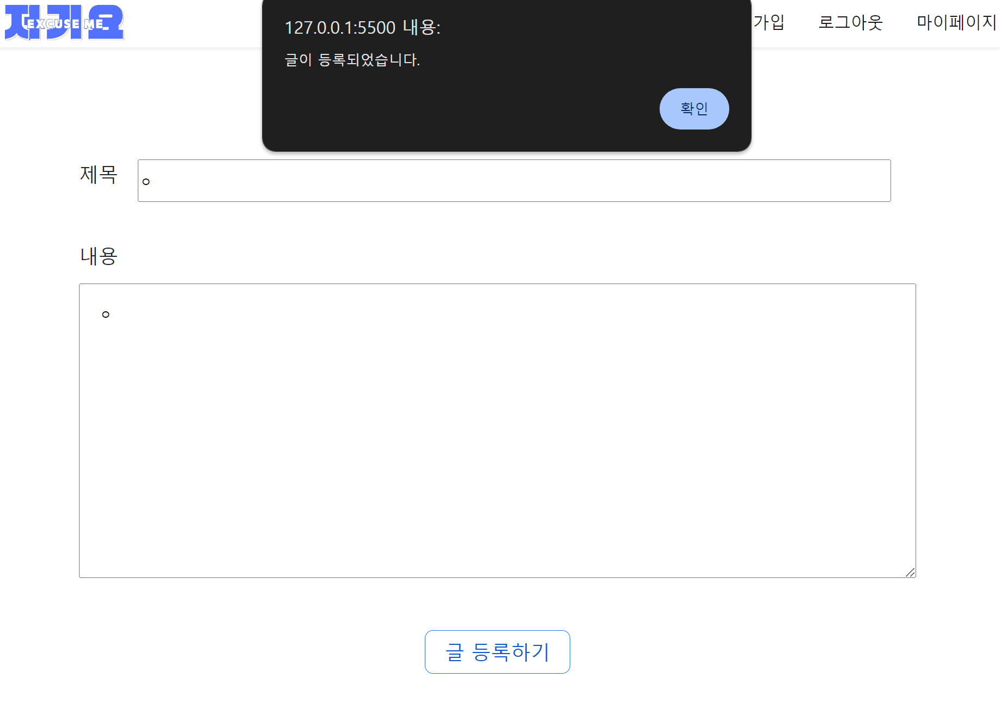
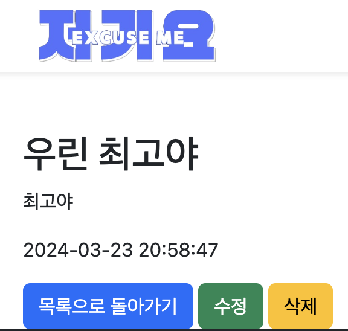

- ## ✔ 심화 기능
  - HotPlace 관련 페이지(팀별 아이디어)
  - 게시판 페이지
