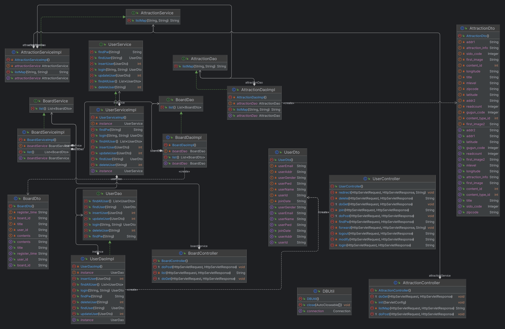

# 🏞 프로젝트 소개

- **🖥PJT명**: **Enjoy Trip Project**
- **🚶‍♂️단계**: **Algorithm PJT**
- **📅진행일자**: **2024.04.05**
- **👩‍💻팀원:** **이지표, 이학현**

- ## 프로젝트 설명
  - 기존 EnjoyTrip 프로젝트의 기능 중 알고리즘 적용이 필요한 곳을 찾고, 알맞은 알고리즘을 구현하여 추가한다
  - 알고리즘은 2개 이상 적용한다.

# 📦클래스 다이어 그램

# ⚙ 알고리즘 기획서

## ✔ 기본 알고리즘 기능

- ### [SHA-256 알고리즘 기획서](docs/plan/algorithm1.md)
- ### [Merge Sort 알고리즘 기획서](docs/plan/algorithm2.md)

## ✔ 추가 알고리즘 기능

- ### [하버사인 알고리즘 기획서](docs/plan/algorithm3.md)
- ### [KMP 알고리즘 기획서](docs/plan/algorithm4.md)
