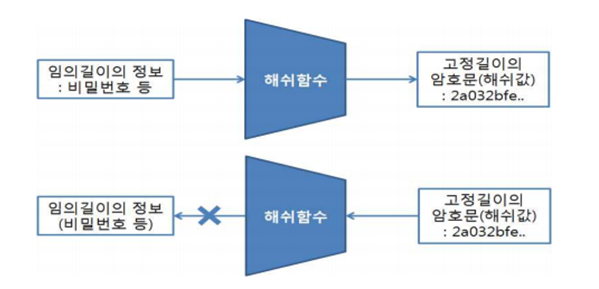

# 알고리즘 적용 기획서 #1

## 내용

- 해싱을 사용한 비밀번호 암호화 서비스

## 적용 알고리즘

- SHA-256 알고리즘

## 알고리즘 개요

- SHA는 Secure Hash Algorithm의 약자를 의미하며, 해시값을 이용한 암호화 방식 중 하나로 단방향 알고리즘 입니다.

- 단방향이란 암호화는 가능하나 복호화가 불가능한 것을 의미 합니다.

  - 암호화란 평문을 암호문으로 바꾸는 작업을 의미하고, 암호문을 평문으로 바꾸는 작없을 복호화라고 합니다.

  - 일반적인 "ABC"라는 값을 SHA-256알고리즘을 적용하면 "4d35adf24Fe634er..."과 같은 64자리의 문자열로 반환합니다. 여기서 "ABC"와 "ABCD"의 암호화된 해시값은 천지 차이이기 때문에 단순 암호화된 해시값으로는 원래의 문자열을 절대 유추할 수 없습니다.

  

## 적용 서비스: join, login

- 회원가입(join) , 로그인(login)

## 적용 서비스 개발 개요

- 사용자가 회원가입 시 입력한 패스워드는 SHA-256 알고리즘을 통해 암호화됩니다. 이렇게 암호화된 패스워드는 데이터베이스에 저장됩니다.

- 사용자가 로그인을 시도할 때, 입력한 패스워드는 다시 SHA-256 알고리즘을 통해 암호화 됩니다.

- 사용자가 입력한 아이디에 해당하는 패스워드의 해시 값이 데이터베이스에서 조회됩니다.

- 사용자가 입력한 패스워드의 해시 값과 데이터베이스에 저장된 해시 값이 일치하는지 확인합니다. 일치하면 로그인 인증에 성공하게 됩니다.

## 어려웠던 점

- 해싱 후 알고즘의 결과 값을 저장할 때 기존 데이터베이스에 저장된 패스워드 컬럼의 저장 길이를 넘어서서 테이블을 수정 하였습니다.

## 적용 코드

```java

	private String hashPassword(String password) throws NoSuchAlgorithmException {
		MessageDigest md = MessageDigest.getInstance("SHA-256");
		md.update(password.getBytes());
		byte[] digest = md.digest();
		StringBuilder hexString = new StringBuilder();
		for (byte b : digest) {
			String hex = Integer.toHexString(0xff & b);
			if (hex.length() == 1) {
				hexString.append('0');
			}
			hexString.append(hex);
		}
		return hexString.toString();
	}

    private String login(HttpServletRequest request, HttpServletResponse response)
			throws ServletException, IOException, NoSuchAlgorithmException {
		String userId = request.getParameter("userid");
		String userPwd = request.getParameter("userpwd");
		// 입력된 비밀번호를 해시합니다.
		String hashedPassword = hashPassword(userPwd);
		System.out.println(userId + " " + hashedPassword); // 로그인 시도 정보를 로그로 남깁니다.
		UserService userService = UserServiceImpl.getInstance();
		// userService.login 메서드가 해시된 비밀번호를 사용하도록 수정해야 합니다.
		UserDto user = userService.login(userId, hashedPassword);
		if (user != null) {
			System.out.println(user);
			HttpSession session = request.getSession();
			session.setAttribute("userinfo", user);
			String saveid = request.getParameter("saveid");
			if (saveid != null) {
				Cookie cookie = new Cookie("tripid", userId);
				cookie.setMaxAge(60 * 60 * 24 * 7); // 1주일
				response.addCookie(cookie);
			} else {
				Cookie[] cookies = request.getCookies();
				if (cookies != null) {
					for (Cookie cookie : cookies) {
						if (cookie.getName().equals("tripid")) {
							cookie.setMaxAge(0); // 쿠키 삭제
							response.addCookie(cookie);
						}
					}
				}
			}
			return "/index.jsp";
		} else {
			request.setAttribute("msg", "아이디 또는 비밀번호가 일치하지 않습니다.");
			return "/user/login.jsp";
		}
	  }

  	private String join(HttpServletRequest request, HttpServletResponse response)
			throws ServletException, IOException, NoSuchAlgorithmException {
		UserDto userDto = new UserDto();
		System.out.println(request.getParameter("userid"));
		userDto.setUserId(request.getParameter("userid"));
		String hashedPassword = hashPassword(request.getParameter("userpwd"));
		userDto.setUserPwd(hashedPassword);
		userDto.setUserName(request.getParameter("username"));
		userDto.setUserEmail(request.getParameter("useremail"));
		userDto.setUserAddr(request.getParameter("useraddr"));
		userDto.setUserGender(request.getParameter("usergender"));
		try {
			UserService userService = UserServiceImpl.getInstance();
			userService.insertUser(userDto);
		} catch (Exception e) {
			e.printStackTrace();
		}
		return "/index.jsp";
	  }
```
