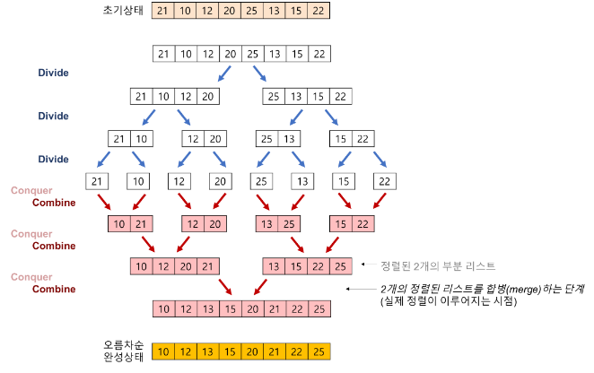

# 알고리즘 적용 기획서 #2

## 내용

- 관광지 순서 정렬 알고리즘

## 적용 알고리즘

- Merge sort(합병 정렬) 알고리즘

## 알고리즘 개요

- ‘존 폰 노이만(John von Neumann)’이라는 사람이 제안한 방법 입니다.

- 일반적인 방법으로 구현했을 때 이 정렬은 안정 정렬에 속하며, 분할 정복 알고리즘의 하나 입니다.
  - 분할 정복(divide and conquer) 방법: 문제를 작은 2개의 문제로 분리하고 각각을 해결한 다음, 결과를 모아서 원래의 문제를 해결하는 전략 입니다.
  - 분할 정복 방법은 대개 순환 호출을 이용하여 구현 합니다.
- 합병 정렬 단계별 예시
  - 분할(Divide): 입력 배열을 같은 크기의 2개의 부분 배열로 분할 합니다.
  - 정복(Conquer): 부분 배열을 정렬한다. 부분 배열의 크기가 충분히 작지 않으면 순환 호출을 이용하여 다시 분할 정복 방법을 적용 합니다.
  - 결합(Combine): 정렬된 부분 배열들을 하나의 배열에 합병합니다.
- 예시

  - 리스트의 길이가 0 또는 1이면 이미 정렬된 것으로 본다.
  - 그렇지 않은 경우에는 정렬되지 않은 리스트를 절반으로 잘라 비슷한 크기의 두 부분 리스트로 나눈다.
  - 각 부분 리스트를 재귀적으로 합병 정렬을 이용해 정렬한다.
  - 두 부분 리스트를 다시 하나의 정렬된 리스트로 합병한다.

    

## 적용 서비스: 관광지 이름순 검색 서비스

- 지역과 관광타입을 결정하고 이름순으로 검색 시 그 결과를 보여줌

## 적용 서비스 개발 개요

- 사용자가 지역과 관광타입을 결정하여 버튼을 누르면 데이터베이스에서 해당하는 결과를 list에 저장합니다.

- 리스트가 비어있으면 결과가 나오지 않습니다.
- 비어있지 않다면 리스트의 내용을 json데이터를 생성 합니다.
- 생성된 데이터를 Merge sort(합병 정렬)로 이름순으로 정렬합니다.
- 정렬된 결과를 사용자에게 보여 줍니다.
