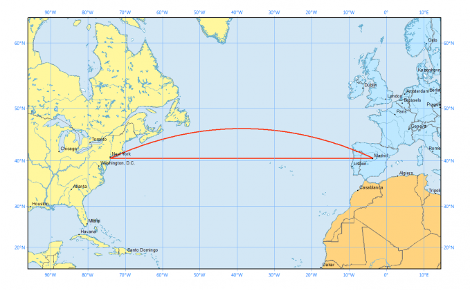

# 알고리즘 적용 기획서 #3

## 내용

- 관광지 거리순서 정렬 알고리즘

## 적용 알고리즘

- 하버사인 포뮬러 알고리즘

## 알고리즘 개요

- 지도를 보면 두 지점 사이의 거리를 구해 줍니다.

- 하지만 지구는 구 형태이기 때문에 위도와 경도로 두 지점 사이의 거리를 구하면 실제 거리와 오차가 발생합니다.
- 그래서 이러한 경우 하버사인 포뮬러 공식을 사용하면 구면 위의 두 점의 위도와 경도가 주어졌을 때, 구면성을 고려하여 위도와 경도를 기준으로 두 지점 사이의 최단 거리를 구할 수 있습니다.

    

## 적용 서비스: 관광지 거리순 검색 서비스

- 지역과 관광타입을 결정하고 거리순으로 검색 시 그 결과를 보여줌

## 적용 서비스 개발 개요

- 사용자가 지역과 관광타입을 결정하고 거리순으로 검색 합니다.

- 데이터베이스에서 해당하는 데이터를 리스트에 담아 옵니다.
- 리스트가 비어 있으면 결과가 나오지 않습니다.
- 리스트가 비어 있지 않다면 데이터를 가져와 하버사인 포뮬러 공식을 통해 거리를 구합니다.
- 구한 결과를 Merge sort(합병 정렬)을 이용하여 거리순으로 정렬합니다.

## 적용 코드

```java

public class DistanceInKilometerByHaversine {

  public static double calculateDistance(double x1, double y1, double x2, double y2) {
    double distance;
    double radius = 6371; // 지구 반지름(km)
    double toRadian = Math.PI / 180;

    double deltaLatitude = Math.abs(x1 - x2) * toRadian;
    double deltaLongitude = Math.abs(y1 - y2) * toRadian;

    double sinDeltaLat = Math.sin(deltaLatitude / 2);
    double sinDeltaLng = Math.sin(deltaLongitude / 2);
    double squareRoot = Math.sqrt(
        sinDeltaLat * sinDeltaLat +
            Math.cos(x1 * toRadian) * Math.cos(x2 * toRadian) * sinDeltaLng * sinDeltaLng);

    distance = 2 * radius * Math.asin(squareRoot);

    return distance;
  }

}

```

```java

public class MergeSortByDistance {

  public static void sort(List<AttractionDto> list, double lat, double lng) {
    for (AttractionDto attraction : list) {
      double distance = DistanceInKilometerByHaversine.calculateDistance(lat, lng,
          Double.parseDouble(attraction.getLatitude()),
          Double.parseDouble(attraction.getLongitude()));
      attraction.setDistance(distance);
    }
    mergeSort(list, 0, list.size() - 1);
  }

  private static void mergeSort(List<AttractionDto> list, int left, int right) {
    if (left < right) {
      int mid = (left + right) / 2;
      mergeSort(list, left, mid);
      mergeSort(list, mid + 1, right);
      merge(list, left, mid, right);
    }
  }

  private static void merge(List<AttractionDto> list, int left, int mid, int right) {
    int i = left;
    int j = mid + 1;

    List<AttractionDto> temp = new ArrayList<>();

    while (i <= mid && j <= right) {
      if (list.get(i).getDistance() < list.get(j).getDistance()) {
        temp.add(list.get(i++));
      } else {
        temp.add(list.get(j++));
      }
    }

    if (i > mid) {
      while (j <= right) {
        temp.add(list.get(j++));
      }
    } else {
      while (i <= mid) {
        temp.add(list.get(i++));
      }
    }

    for (int k = 0; k < temp.size(); k++) {
      list.set(left + k, temp.get(k));
    }
  }
}

```
