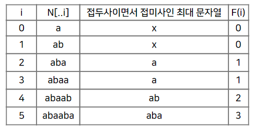

# 알고리즘 적용 기획서 #4

## 내용

- KMP 알고리즘을 이용한 관광지 검색 서비스

## 적용 알고리즘

- KMP 알고리즘

## 알고리즘 개요

- Knuth-Morris-Pratt Algorithm을 줄여서 KMP 알고리즘이라 합니다.
- 문자열이 주어졌을때 그 문자열 안에서 어떠한 패턴을 효율적으로 찾는 알고리즘 입니다.
- KMP 알고리즘의 핵심은 이전까지 비교 했던 정보를 기억하는 것 입니다.
- 접두사와 접미사를 활용해서 일정 부분이 맞는다면 Jump 하는 방식입니다.

  

## 적용 서비스: 원하는 관광지 검색 서비스

- 원하는 관광지의 이름을 검색 했을때 해당 관광지 조회

## 적용 서비스 개발 개요

- 사용자가 지역과 관광지타입을 선택하고 원하는 관광지의 이름을 검색 합니다.

- 입력 받은 문자를 접두사와 접미사로 나누어 최대일치 부분을 점차 늘려 갑니다.

- 검색한 문자와 최대일치 부분이 같은 결과를 사용자에게 보여 줍니다.

## 적용 코드

```java

if (keyword != null && !keyword.isBlank()) {
	int[] lps = KMP.getLPS(keyword);
	list.removeIf(dto -> !KMP.match(dto.toString(), keyword, lps));
}

```

```java
public class KMP {

  public static int[] getLPS(String pattern) {
    int patternLen = pattern.length();
    int[] lps = new int[patternLen];
    int j = 0;
    for (int i = 1; i < patternLen; i++) {
      if (pattern.charAt(i) == pattern.charAt(j)) {
        lps[i] = j + 1;
        j++;
      }
    }
    return lps;
  }

  public static boolean match(String text, String pattern, int[] lps) {
    int textLen = text.length();
    int patternLen = lps.length;
    int j = 0;
    for (int i = 0; i < textLen; i++) {
      while (j > 0 && text.charAt(i) != pattern.charAt(j)) {
        j = lps[j - 1];
      }
      if (text.charAt(i) == pattern.charAt(j)) {
        j++;
      }
      if (j == patternLen) {
        return true;
      }
    }
    return false;
  }
}
```
